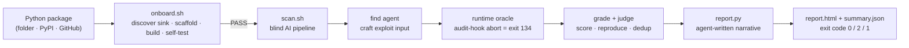

# ProofScan — Autonomous Vulnerability Discovery for Python


> An autonomous, **execution-verified** vulnerability-discovery pipeline for Python packages.
> Point it at any Python codebase — a folder, a PyPI name, or a GitHub URL — and it
> discovers the dangerous code, builds an isolated test target, drives an AI agent to
> **craft and prove a working exploit**, and writes a professional HTML security report.

This project extends Anthropic's `defending-code-reference` harness — originally built to
find **C memory-safety bugs** with AddressSanitizer — to the **Python vulnerability classes
that never crash on their own**: unsafe deserialization, sandbox escape, OS command
injection, and SSRF. Instead of relying on ASAN, each target ships a purpose-built **runtime
oracle** that turns "an exploit actually happened" into a deterministic process abort the
pipeline can detect.

---

## Table of contents

- [Why this exists](#why-this-exists)
- [What it can do — vulnerability classes](#what-it-can-do--vulnerability-classes)
- [Language & tech stack](#language--tech-stack)
- [How it works](#how-it-works)
- [Setup](#setup)
- [Usage — step by step, with examples](#usage--step-by-step-with-examples)
- [What's in the report](#whats-in-the-report)
- [Report-time enrichment](#report-time-enrichment-for-known-cves)
- [CI/CD gating](#cicd-gating)
- [Repository layout](#repository-layout)
- [Security & authorized use](#security--authorized-use)
- [License](#license)

---

## Why this exists

A memory-safety bug announces itself: the process crashes and AddressSanitizer prints a
stack trace. A **logic** vulnerability does not. `yaml.load()` on a malicious document runs
attacker code and returns normally; `pickle.loads()` executes a payload silently. There is
no crash for a fuzzer or a pipeline to key on.

The core idea here is a **tool-agnostic, honest execution oracle**. Each Python target wraps
its sink in a [PEP 578](https://peps.python.org/pep-0578/) audit hook (`sys.addaudithook`)
that aborts the process (`os._exit(134)` → the same exit code a SIGABRT produces) the instant
deserialization/rendering reaches a dangerous primitive — `exec`/`compile`, `os.system`,
`subprocess.Popen`, an outbound socket, a dangerous import, or a sensitive-file open. To the
discovery pipeline, "the exploit fired" now looks exactly like "the target crashed" — so the
same find → grade → judge → report loop that hunts C bugs works unchanged for Python RCE.

The oracle is deliberately **honest**: it never prints a fake `AddressSanitizer` banner. It
emits a `SECURITY-ORACLE` banner naming the real primitive reached (e.g. `os.system`) and the
real Python call stack at the moment it fired.

---

## What it can do — vulnerability classes

ProofScan discovers bugs by **class**. Its oracle keys on the dangerous *runtime primitive*
an exploit must reach — `exec` / `compile`, `os.system`, `subprocess`, an outbound socket, a
dangerous import, a sensitive-file open — so it catches any input that drives a target into
that primitive. The AI *find* agent crafts each exploit from scratch, and the onboarder
discovers the sink in whatever package you point it at — so it works on your own code as well
as the examples below.

| Class it discovers | What trips the oracle | Sinks the onboarder recognizes |
|---|---|---|
| **Unsafe deserialization → RCE** | object reconstruction reaches `exec` / a dangerous import / `subprocess` | `pickle`, `dill`, `joblib`, `cloudpickle`, `marshal`, `jsonpickle`, `yaml.load` |
| **Sandbox escape → RCE** | a "safe eval" / template engine reaches `os.system` or a real import | expression & template evaluators |
| **OS command injection** | attacker text reaches `os.system` / `subprocess(shell=True)` | `os.system`, `os.popen`, `subprocess(..., shell=True)` |
| **Server-Side Request Forgery** | a fetch reaches an internal / attacker-chosen host | `urllib` / `requests` fetchers, redirect-followers |
| **Template injection (SSTI)** | template render reaches `exec` / an import | `Template(...).render()` on untrusted input |
| **Path traversal / arbitrary read** | `open()` escapes its intended directory | `open(os.path.join(base, user_input))` |

### Validated on real CVEs

Each class is demonstrated end-to-end against a known-vulnerable library pinned to a **real,
cross-verified CVE** (checked against NVD, OSV.dev, and GitHub Advisories before building):

| Class | Validated target (library) | CVE (benchmark) | What the run proves |
|---|---|---|---|
| Deserialization → RCE | PyYAML 5.3.1 (`targets/pyyaml/`) | [CVE-2020-14343](https://nvd.nist.gov/vuln/detail/CVE-2020-14343) | `yaml.load(FullLoader)` gadget reaches `exec` |
| Sandbox escape → RCE | ReportLab (`targets/reportlab/`) | [CVE-2023-33733](https://nvd.nist.gov/vuln/detail/CVE-2023-33733) | `rl_safe_eval` escape reaches `os.system` |
| Command injection | yt-dlp (`targets/ytdlp/`) | [CVE-2026-26331](https://nvd.nist.gov/vuln/detail/CVE-2026-26331) | attacker hostname → `netrc_cmd` (`shell=True`) |
| Command injection (blind) | textract (`targets/textract/`) | [CVE-2016-10320](https://nvd.nist.gov/vuln/detail/CVE-2016-10320) | filename metacharacters → `antiword` shell call |
| SSRF | WeasyPrint (`targets/weasyprint/`) | [CVE-2025-68616](https://nvd.nist.gov/vuln/detail/CVE-2025-68616) | redirect bypass reaches an internal canary |

The onboarder was validated the same way: pointed at **pyod 3.5.2** by name, it discovered the
`joblib.load` sink in `pyod/utils/persistence.py`
([CVE-2026-15529](https://nvd.nist.gov/vuln/detail/CVE-2026-15529)) on its own.

---

## Language & tech stack

| Layer | Technology |
|---|---|
| Targets, oracle, onboarder, report engine | **Python 3.9–3.12** |
| Detection oracle | Python **audit hooks** (PEP 578) — no external tooling |
| Orchestration & helper scripts | **Bash** |
| Target isolation | **Docker** images run under **gVisor (`runsc`)** with an egress allow-list |
| AI agents (find / grade / report) | **Claude**, via the `defending-code-reference` `vuln-pipeline` |
| Report rendering | Python + **Pillow** (terminal-screenshot proofs) → self-contained **HTML** |

The vulnerable libraries themselves are pure Python (PyYAML, ReportLab, yt-dlp, WeasyPrint,
textract), which is exactly why a memory sanitizer can't see the bugs and a runtime oracle is
required.

---

## How it works



1. **Onboard** greps the source for known sink patterns, an agent picks the real entry point
   and writes example inputs, then it scaffolds a Docker target and **self-tests** it: the
   exploit input must abort (exit 134) and a benign input must exit 0. Only a target that
   passes this gate is worth scanning.
2. **Scan** runs the blind pipeline: a *find* agent (which is **never told the bug**) crafts
   an input, the oracle confirms whether it fired, a *grade* agent reproduces and scores it,
   and a *judge* de-duplicates across runs.
3. **Report** feeds the pipeline's own source-level analysis to a single **report-writer
   agent** that writes the entire professional narrative; deterministic Python renders the
   proof screenshots and assembles a self-contained, light-theme HTML page + `summary.json`.

Everything executes inside the gVisor sandbox with the host filesystem unreachable and
network egress restricted to the model API only.

---

## Setup

ProofScan runs on **Linux** — every target is isolated in Docker under the gVisor (`runsc`)
runtime, which needs a Linux kernel. Pick how you get a Linux host for your OS below, then run
the **common steps** once inside it.

> A *native* Docker daemon is required. Docker Desktop's VM does **not** work — the sandbox
> setup registers the `runsc` runtime in the host's own `dockerd`.

### Windows — via WSL2

```powershell
wsl --install -d Ubuntu      # install once, then open the Ubuntu shell for everything below
```

Inside Ubuntu, install the **native in-distro Docker Engine** (not Docker Desktop
integration), plus `git`, Python 3.9+, and Node 20 with the `claude` CLI. Then run the
**common steps**.

> Drive any `wsl` commands from PowerShell (Git Bash mangles `/root/...` paths), and keep
> double quotes around paths that contain a space.

### macOS — via a Linux VM

gVisor needs a Linux kernel, so run everything inside a lightweight Linux VM (or a remote
Linux box):

```bash
brew install colima docker
colima start --cpu 4 --memory 8      # a Linux VM with a native Docker daemon
```

Inside the VM, install `git`, Python 3.9+, and Node 20 with the `claude` CLI, then run the
**common steps**.

### Linux — native

Install **Docker Engine**, `git`, Python 3.9+, and Node 20 with the `claude` CLI, then run the
common steps directly.

### Common steps (inside your Linux environment)

```bash
# 1) Install the defending-code-reference harness (provides the `vuln-pipeline` CLI)
cd defending-code-reference-harness
python3 -m venv .venv && . .venv/bin/activate
pip install -e .

# 2) Provide a model token
claude setup-token                              # mints a CLAUDE_CODE_OAUTH_TOKEN
echo "<the sk-ant-oat token>" > ~/.vp_token && chmod 600 ~/.vp_token
export CLAUDE_CODE_OAUTH_TOKEN=$(cat ~/.vp_token)
# (Bedrock / Vertex / ANTHROPIC_API_KEY also work — see the harness auth.py)

# 3) Build the gVisor sandbox (one time)
./scripts/setup_sandbox.sh                      # installs runsc, registers the runtime + egress proxy

# 4) Add ProofScan and install its report dependencies
git clone https://github.com/0xsharz/proofscan.git
cd proofscan
easyscan/install.sh                             # pillow + a mono font; smoke-tests the engine
```

---

## Usage — step by step, with examples

There are two ways in: the **fully automatic** onboarder for any package, or running one of
the **pre-built targets** directly.

### A. Scan any Python package (fully automatic)

```bash
# 1) Onboard — discovers the sink, scaffolds a target, builds and self-tests it
easyscan/onboard.sh requests==2.31.0             # a PyPI package (optionally version-pinned)
easyscan/onboard.sh https://github.com/org/repo   # a GitHub repo
easyscan/onboard.sh ./downloaded-code             # a local folder
```
```
[1/4] discover — fetching source and grepping for sinks ...
    [deserialization] joblib.load   pyod/utils/persistence.py:215
[2/4] analyze — picking the entry point + example inputs ...
[3/4] scaffold — writing targets/pyod/ ...
[4/4] build + self-test ...
  SELF-TEST: exploit input -> exit 134 (want 134)   benign -> exit 0 (want 0)
  RESULT: PASS  — the target detects the vulnerability.
```
```bash
# 2) Scan — only if step 1 said PASS. Blind AI run → agent-written HTML report
easyscan/scan.sh pyod --auto-focus

# 3) The report lands next to the run; open report.html in a browser
ls -td ~/defending-code-reference-harness/results/pyod/*/ | head -1
```

**Onboard is blind by design** — you never tell it the bug or where it lives. The self-test
is a safety gate: it refuses to hand you a scan for a sink it can't actually trigger.

### B. Run a pre-built target directly

```bash
# Copy a target into the harness, build it, then scan it
cp -r targets/pyyaml ~/defending-code-reference-harness/targets/pyyaml
docker build -t vuln-pipeline-pyyaml:latest ~/defending-code-reference-harness/targets/pyyaml

easyscan/scan.sh pyyaml --model claude-opus-4-8 --runs 3
```

### C. Re-generate only the report (no AI scan)

Useful after a run, or to regenerate with different options:

```bash
easyscan/scan.sh pyyaml --report-only results/pyyaml/<timestamp>/
# or call the engine directly:
.venv/bin/python easyscan/report.py results/pyyaml/<timestamp>/ --model claude-opus-4-8
```

Watch the `[easyscan] prose:` line — `agent` means the report-writer agent wrote it;
`template` means it was throttled and fell back to the (clearly-flagged) deterministic
template.

### D. Self-test an oracle for free (no agent, no cost)

Every target's oracle can be checked deterministically before spending a scan:

```bash
# malicious input -> exit 134 ; benign input -> exit 0
docker run --rm vuln-pipeline-pyyaml:latest /work/entry /path/to/malicious.yaml; echo $?
```

---

## What's in the report

A professional, **light-theme**, numbered HTML page — identical in shape for every
vulnerability class, with **no memory-safety jargon**:

1. **Executive summary** — what, how severe, and that it was proven by execution
2. **Finding overview** — severity, CVE, CVSS, CWE, component, fixed version
3. **Description**
4. **Attack walkthrough** — ordered steps
5. **Proof of concept** — real captured terminal screenshots: the oracle firing, the exact
   PoC input (readable + hexdump), and — where applicable — a **live execution witness**
   running a harmless `id` through the injection point. Includes an honest *"Scope of this
   proof"* caveat distinguishing "sink confirmed in an isolated harness" from "full network
   chain replayed against a live server."
6. **Root cause** — the exact file(s), line number(s), and verbatim vulnerable code
7. **Exploitability & exposure** *(when provided)* — default config, auth interaction, fix scope
8. **Impact**
9. **Remediation** — specific, line-wise fixes with corrected, paste-ready code, matched to
   the *actual* sink (a `pickle` / `dill` finding never gets a `yaml.safe_load` fix)
10. **References** — CVE / CWE, linked

Every report ships alongside a machine-readable `summary.json`. A sample is committed at
[`easyscan/sample/pyyaml_report.html`](easyscan/sample/pyyaml_report.html).

---

## Report-time enrichment (for known CVEs)

A blind, egress-locked scan cannot know facts it can't derive from the pinned source — the
assigned CVE, the upstream fixed version, a CVSS score, or human-verified exposure notes.
Those are supplied **after** the finding is confirmed, via an `enrichment.json` dropped in the
results folder (or `--cve` / `--cvss` / `--fixed-version` / `--advisory` flags). Enrichment is
**report-time only** and never touches the blind find/config, so it can't bias discovery.

```jsonc
// results/<target>/<ts>/enrichment.json
{
  "cve": "CVE-2026-56121",
  "fixed_version": "0.63.0",
  "cvss": "9.8",
  "context": "**Pre-auth reachability.** The UDF body is deserialized before the authz check…"
}
```

---

## CI/CD gating

`scan.sh` exits with a documented contract, so a CI step is a one-liner:

| Exit code | Meaning |
|---|---|
| `0` | Ran clean — **no confirmed finding** |
| `2` | **Confirmed finding** present (see `report.html`) |
| `1` | Setup/usage error before the run |

```yaml
# GitHub Actions
- run: easyscan/scan.sh pyyaml        # job fails on exit 2 → a confirmed vuln blocks the pipeline
- uses: actions/upload-artifact@v4
  if: always()
  with: { name: security-report, path: "**/report.html" }
```

---

## Repository layout

```text
proofscan/
├── targets/             # the vulnerability targets — one self-contained dir each
│   ├── pyyaml/          #   PyYAML — unsafe deserialization RCE (CVE-2020-14343)
│   │   ├── entry.py     #     the audit-hook detection oracle
│   │   ├── config.yaml  #     target config
│   │   ├── artifacts/   #     PoC + confirmed-run evidence
│   │   └── demo/        #     runnable demo
│   ├── reportlab/       #   ReportLab — rl_safe_eval sandbox escape RCE (CVE-2023-33733)
│   ├── ytdlp/           #   yt-dlp — command injection via netrc_cmd (CVE-2026-26331)
│   ├── weasyprint/      #   WeasyPrint — SSRF via redirect bypass (CVE-2025-68616)
│   └── textract/        #   textract — command injection, blind test (CVE-2016-10320)
├── easyscan/            # the pipeline itself
│   ├── onboard.sh       #   discover a sink in any package, scaffold + self-test a target
│   ├── scan.sh          #   run the blind AI pipeline (exit 0 clean / 2 finding / 1 error)
│   ├── report.py        #   build the professional HTML report + summary.json
│   ├── install.sh       #   one-time setup + smoke test
│   └── ONBOARD_GUIDE.md #   plain-language step-by-step runbook
├── toolkit/             # reusable oracle + new_target.sh generator + COOKBOOK.md
├── harness-patches/     # fixes to the upstream harness
├── docs/                # write-ups and design notes
└── scripts/             # helper scripts
```

Every `*-target/` folder is **self-contained** — its PoC and confirmed-run evidence live in
`<target>/artifacts/`. Plain-language runbooks live in
[`easyscan/ONBOARD_GUIDE.md`](easyscan/ONBOARD_GUIDE.md) and each target's `README` / `GUIDE.md`.

---

## Security & authorized use

> This repository deliberately contains **working exploits** and **pinned-vulnerable
> dependencies**, for **authorized security research and defensive testing only**. Do not
> deploy the targets. Run them exclusively inside the sandboxed harness. Every CVE referenced
> here was verified against public advisories before a target was built; blind-test targets
> keep the answer key (`vulns.txt`) out of the pipeline's reach so discovery stays honest.

---

## License

Apache-2.0. See SPDX headers in source files.
